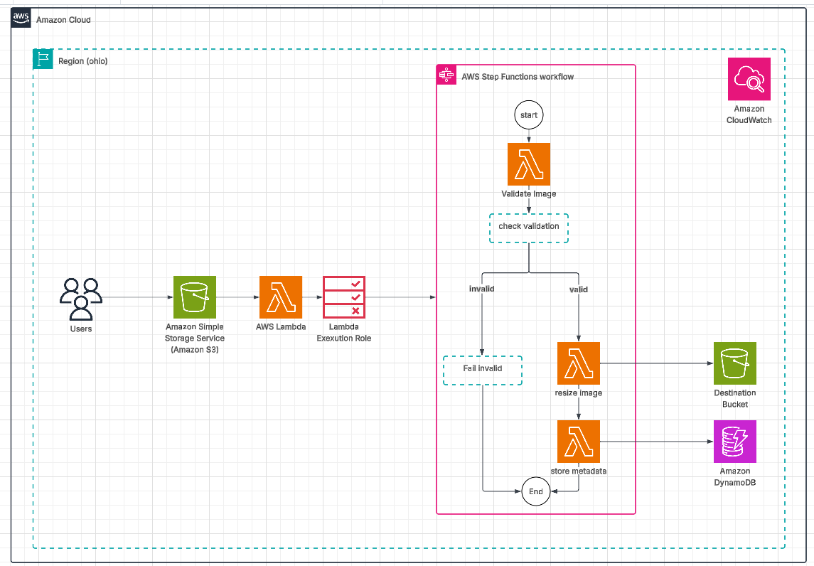

# Building a Serverless Image Processing Application with AWS Lambda (Manara-project)

This project provides a step-by-step guide to building a **serverless image processing application** on AWS. Users upload images to an Amazon S3 bucket, which triggers an AWS Lambda function to resize or process the image (e.g., watermarking) before saving it to another S3 bucket. Metadata about each image is stored in DynamoDB for tracking and querying. The project also integrates API Gateway for image upload endpoints and Step Functions for orchestrating workflows.

---


# 📘 Table of Contents
* [🧱 Project Architecture Overview](#-project-architecture-overview)
- [🔹 0) Naming Convention (use everywhere consistently)](#-0-naming-convention-use-everywhere-consistently)
- [1) Create S3 Buckets (GUI)](#1-create-s3-buckets-gui)
  - [1.1 Source bucket](#11-source-bucket)
  - [1.2 Destination bucket](#12-destination-bucket)
- [2) Create DynamoDB Table (GUI)](#2-create-dynamodb-table-gui)
- [3) Create IAM Roles](#3-create-iam-roles)
  - [3.1 Lambda Execution Role (Validate/Resize/Metadata)](#31-lambda-execution-role-validateresizemetadata-validateimage--resizeimage---storeimagemetadata-)
  - [3.2 Trigger Lambda Role (StartImageWorkflow)](#32-trigger-lambda-role-startimageworkflow)
  - [3.3 Step Functions Role](#33-step-functions-role)
- [4) Create the Pillow Lambda Layer (GUI)](#4-create-the-pillow-lambda-layer-gui)
  - [4.1 Prepare the Layer Locally](#41-prepare-the-layer-locally)
  - [4.2 Create the Lambda Layer](#42-create-the-lambda-layer)
- [5) Create Lambda Functions (GUI)](#5-create-lambda-functions-gui)
  - [5.1 ValidateImage](#51-validateimage)
  - [5.2 ResizeImage](#52-resizeimage)
  - [5.3 StoreImageMetadata](#53-storeimagemetadata)
- [6) Create Step Function (GUI)](#6-create-step-function-gui)
- [7) Create Trigger Lambda (StartImageWorkflow)](#7-create-trigger-lambda-startimageworkflow)
  - [7.1 Create the function](#71-create-the-function)
- [8) Configure S3 Event Notifications (GUI) — Source bucket](#8-configure-s3-event-notifications-gui--source-bucket)
- [9) End-to-End Test (GUI)](#9-end-to-end-test-gui)
  - [9.1 Upload a test image](#91-upload-a-test-image)
  - [9.2 Verify trigger Lambda](#92-verify-trigger-lambda)
  - [9.3 Verify Step Functions execution](#93-verify-step-functions-execution)
  - [9.4 Verify resized image in destination bucket](#94-verify-resized-image-in-destination-bucket)
  - [9.5 Verify DynamoDB item](#95-verify-dynamodb-item)
* [🧑‍💻 Author](#-author)
* [📜 License](#-license)
* [ Project (Video)](#project-implementation-video)

---

## 🧱 Project Architecture Overview

- The deployed infrastructure includes:
- Amazon S3 source bucket (bucket-source-manara) to store original images
- Amazon S3 destination bucket (bucket-dest-manara) to store resized images
- AWS Lambda function triggered by S3 events to start the workflow
- AWS Step Functions state machine to orchestrate image validation and resizing
- AWS Lambda functions for image validation and image resizing
- DynamoDB table (ImagePipeline-Metadata) for storing metadata of processed images
- IAM Roles and Policies for Lambda functions with S3, DynamoDB, and Step Functions access
- CloudWatch Logs for monitoring Lambda execution and workflow steps



---

# 🔹 0) Naming Convention (use everywhere consistently)

- **Region**: `<REGION>` (e.g., `us-east-1`)
- **Source bucket**: `bucket-source-manara`
- **Destination bucket**: `bucket-dest-manara`
- **DynamoDB table**: `ImagePipeline-Metadata`
- **Step Function**: `ImagePipeline-Processor`
- **Lambda functions**:
    - Trigger: `StartImageWorkflow`
    - Validate: `ValidateImage`
    - Resize: `ResizeImage`
    - Store Metadata: `StoreImageMetadata`
- **IAM Roles**:
    - Lambda execution: `ImagePipeline-LambdaRole`
    - Trigger Lambda role: `ImagePipeline-TriggerRole`
    - Step Function execution: `ImagePipeline-StateMachineRole`

---

# 1) Create S3 Buckets (GUI)

## 1.1 Source bucket

1. **S3 → Create bucket**
2. Name: `bucket-source-manara`
3. Region: `<REGION>`
4. Block all public access: **ON**
5. Default encryption: **SSE-S3**
6. Click **Create bucket**

## 1.2 Destination bucket

1. **S3 → Create bucket**
2. Name: `bucket-dest-manara`
3. Block public access: **ON**
4. Default encryption: **SSE-S3**
5. Optional: create a folder **`resized/`** to organize resized images
6. Click **Create bucket**

---

# 2) Create DynamoDB Table (GUI)

1. **DynamoDB → Tables → Create table**
2. Table name: `ImagePipeline-Metadata`
3. Partition key: `imageKey` (String)
4. Keep all defaults → **Create table**

---

# 3) Create IAM Roles

## 3.1 Lambda Execution Role (Validate/Resize/Metadata) (`ValidateImage`- `ResizeImage` - `StoreImageMetadata` )

1. **IAM → Roles → Create role** → → → **Choose Trusted entity type → AWS service** → → →  **Use case → Lambda**
2. Attach managed policy: **AWSLambdaBasicExecutionRole** (for logs) 
3. Role name: `ImagePipeline-LambdaRole` 
4. create Role 
5. Add Inline policy (JSON):
  - From the IAM **Roles** list → click `ImagePipeline-LambdaRole`.
  - On the **Permissions** tab → **Add permission** → click **create inline policy**.
  - Choose the **JSON** tab and paste this policy
  - Policy name : `ImagePipeline-S3DDBPolicy`


```json
{
  "Version": "2012-10-17",
  "Statement": [
    {
      "Sid": "S3ReadWrite",
      "Effect": "Allow",
      "Action": ["s3:GetObject", "s3:PutObject"],
      "Resource": [
        "arn:aws:s3:::bucket-source-manara/*",
        "arn:aws:s3:::bucket-dest-manara/*"
      ]
    },
    {
			"Sid": "SourceBucketList",
			"Effect": "Allow",
			"Action": [
				"s3:ListBucket"
			],
			"Resource": [
				"arn:aws:s3:::bucket-source-manara/*",
				"arn:aws:s3:::bucket-dest-manara/*"
			]
		},
    {
      "Sid": "DDBWrite",
      "Effect": "Allow",
      "Action": ["dynamodb:PutItem"],
      "Resource": "arn:aws:dynamodb:<REGION>:<ACCOUNT_ID>:table/ImagePipeline-Metadata"
    }
  ]
}

```

---

## 3.2 Trigger Lambda Role (`StartImageWorkflow`)

1. **IAM → Roles → Create role** → → → **Choose Trusted entity type → AWS service** → → →  **Use case → Lambda**
2. Attach managed policy: **AWSLambdaBasicExecutionRole** (for logs) 
3. Role name: `ImagePipeline-TriggerRole` 
4. create Role 
5. Add Inline policy (JSON):                               " later after creating the step function to use its ARN "
  - From the IAM **Roles** list → click `ImagePipeline-TriggerRole`.
  - On the **Permissions** tab → **Add permission** → click **create inline policy**.
  - Choose the **JSON** tab and paste this policy
  - Policy name : `AllowStepFunctionStartExecution`


```json
{
  "Version": "2012-10-17",
  "Statement": [
    {
      "Sid": "StartStepFunctions",
      "Effect": "Allow",
      "Action": ["states:StartExecution"],
      "Resource": "arn:aws:states:<REGION>:<ACCOUNT_ID>:stateMachine:ImagePipeline-Processor"
    }
  ]
}

```

---

## 3.3 Step Functions Role

1. **IAM → Roles → Create role** → → → **Choose Trusted entity type → AWS service** → → →  **Use case → Step Functions**
3. Role name: `ImagePipeline-StateMachineRole` 
4. create Role 
5. Add Inline policy (JSON):                                    " later after creating the 3 lambda to use their ARN "
  - From the IAM **Roles** list → click `ImagePipeline-StateMachineRole`.
  - On the **Permissions** tab → **Add permission** → click **create inline policy**.
  - Choose the **JSON** tab and paste this policy
  - Policy name : `ImagePipeline-InvokeLambdaPolicy`


```json
{
  "Version": "2012-10-17",
  "Statement": [
    {
      "Sid": "InvokeLambdas",
      "Effect": "Allow",
      "Action": ["lambda:InvokeFunction"],
      "Resource": [
        "arn:aws:lambda:<REGION>:<ACCOUNT_ID>:function:ValidateImage",
        "arn:aws:lambda:<REGION>:<ACCOUNT_ID>:function:ResizeImage",
        "arn:aws:lambda:<REGION>:<ACCOUNT_ID>:function:StoreImageMetadata"
      ]
    }
  ]
}

```

# 4) Create the Pillow Lambda Layer (GUI)

✅ Since we need to resize an image and save it to a destination S3 bucket, we’ll need Pillow (PIL) because AWS Lambda alone does not have built-in image processing capabilities.
we must add Pillow to your Lambda deployment package (either via Lambda Layer or zip with dependencies).

## 4.1 Prepare the Layer Locally
  - we will create a python directory, install Pillow inside it, and zip it.

```bash
# Create a working folder
mkdir python

# Install Pillow into this folder
pip install Pillow -t python/

# Zip the contents (important: zip from inside the parent directory so "python/" is at the root of the zip)
zip -r pillow_layer.zip python
```

👉 Now you have pillow_layer.zip which contains Pillow in a python/ directory (the exact structure Lambda expects).

## 4.2 Create the Lambda Layer
1.  Go to **AWS Console → Lambda** → → →  On the left sidebar, click **Layers** → **Create Layer**
  - Enter a **Layer name**, e.g., `pillow-layer`
  - Upload  `pillow_layer.zip` file
  - Under **Compatible runtimes**, choose the one you use (e.g., Python 3.11.)
  - Click **Create**


# 5) Create Lambda Functions (GUI)

## 5.1 ValidateImage

1. Go to Lambda Console → **Create function**
  - Author from scratch
  - Name: e.g., `ValidateImage`
  - Runtime: Python 3.12 
  - Permissions: choose execution role  ( `ImagePipeline-LambdaRole` )
  - Memory: 512 MB, Timeout: 30s

2. Add Code 
  - Go to **AWS Lambda → Functions** → `ValidateImage`
  - Paste your Python code into "lambda_function.py".
  - Click Deploy.

```python
import boto3

def lambda_handler(event, context):
    s3 = boto3.client("s3")
    bucket = event["bucket"]
    key = event["key"]

    # Basic check: accept only jpg/png extension
    if not key.lower().endswith((".jpg", ".jpeg", ".png")):
        return {"bucket": bucket, "key": key, "isValid": False, "error": "Invalid file type"}

    return {"bucket": bucket, "key": key, "isValid": True}

```

---

## 5.2 ResizeImage
1. Go to Lambda Console → **Create function**
  - Author from scratch
  - Name: e.g., `ResizeImage`
  - Runtime: Python 3.12 
  - Permissions: choose execution role  ( `ImagePipeline-LambdaRole` )
  - Memory: 512 MB, Timeout: 30s ( because image resizing + S3 upload often takes longer than the default limit )

2. Add Code 
  - Go to **AWS Lambda → Functions** → `ResizeImage`
  - Paste your Python code into "lambda_function.py".
  - Click Deploy.

```python
import boto3
from PIL import Image
import io

DEST_BUCKET = "bucket-dest-manara"

def lambda_handler(event, context):
    s3 = boto3.client("s3")
    source_bucket = event["bucket"]
    key = event["key"]
    target_size = (800, 600)

    try:
        obj = s3.get_object(Bucket=source_bucket, Key=key)
        img_data = obj["Body"].read()
        image = Image.open(io.BytesIO(img_data))
        resized = image.resize(target_size, Image.LANCZOS)

        buffer = io.BytesIO()
        resized.save(buffer, format=image.format)
        new_key = f"resized/{key}"
        s3.put_object(Bucket=DEST_BUCKET, Key=new_key, Body=buffer.getvalue())

        return {"bucket": DEST_BUCKET, "key": new_key}
    except Exception as e:
        return {"error": str(e)}

```
3. Attach the Layer to Your Lambda Function 
  - open **Lambda function** named `ResizeImage`
  - Scroll down to the **Layers** section
  -  Click **Add a layer**
      - Choose **Custom layers**
      - Select the `pillow-layer` you just created
      - Pick the version
  - Save changes

---

## 5.3 StoreImageMetadata
1. Go to Lambda Console → **Create function**
  - Author from scratch
  - Name: e.g., `StoreImageMetadata`
  - Runtime: Python 3.12 
  - Permissions: choose execution role  ( `ImagePipeline-LambdaRole` )
  - Memory: 512 MB, Timeout: 30s

2. Add Code 
  - Go to **AWS Lambda → Functions** → `StoreImageMetadata`
  - Paste your Python code into "lambda_function.py".
  - Click Deploy.

```python
import boto3

DDB_TABLE = "ImagePipeline-Metadata"

def lambda_handler(event, context):
    dynamodb = boto3.resource("dynamodb")
    table = dynamodb.Table(DDB_TABLE)
    key = event["key"]

    item = {
        "imageKey": key,
        "status": "Resized"
    }

    table.put_item(Item=item)
    return {"status": "Metadata stored"}

```

---

# 6) Create Step Function (GUI)

1. AWS Console → Step Functions.
  - Click Create state machine.
  - Type: **Standard** . 

2. Config section  → **permissions** tab → → Choose **Use existing role** →→   select : `ImagePipeline-StateMachineRole`.
   (optional) Config section  → **logging** tab → → **Log level: All**  → CloudWatch Logs → Create a new log group (e.g., /aws/vendedlogs/states/ImagePipeline-Processor-Logs).
            "need to add permission to stepfunction to access this path"
3. code section → 

```json
{
  "StartAt": "ValidateImage",
  "States": {
    "ValidateImage": {
      "Type": "Task",
      "Resource": "arn:aws:lambda:<REGION>:<ACCOUNT_ID>:function:ValidateImage",
      "ResultPath": "$.validation",
      "Next": "CheckValidation"
    },
    "CheckValidation": {
      "Type": "Choice",
      "Choices": [
        {"Variable": "$.validation.isValid", "BooleanEquals": true, "Next": "ResizeImage"}
      ],
      "Default": "FailInvalid"
    },
    "ResizeImage": {
      "Type": "Task",
      "Resource": "arn:aws:lambda:<REGION>:<ACCOUNT_ID>:function:ResizeImage",
      "ResultPath": "$.resized",
      "Next": "StoreMetadata"
    },
    "StoreMetadata": {
      "Type": "Task",
      "Resource": "arn:aws:lambda:<REGION>:<ACCOUNT_ID>:function:StoreImageMetadata",
      "End": true
    },
    "FailInvalid": {
      "Type": "Fail",
      "Error": "InvalidFile",
      "Cause": "Uploaded file is not valid"
    }
  }
}

```

---

# 7) Create Trigger Lambda (`StartImageWorkflow`)

## 7.1 Create the function

1. Go to Lambda Console → **Create function**
  - Author from scratch
  - Name: e.g., `StartImageWorkflow`
  - Runtime: Python 3.12 
  - Permissions: choose execution role  ( `ImagePipeline-TriggerRole` )
  - Memory: 512 MB, Timeout: 30s

2. Add Code 
  - Go to **AWS Lambda → Functions** → `StartImageWorkflow`
  - Paste your Python code into "lambda_function.py".
  - Click Deploy.

```python
import json
import boto3

SFN_ARN = "arn:aws:states:<REGION>:<ACCOUNT_ID>:stateMachine:ImagePipeline-Processor"
sfn = boto3.client("stepfunctions")

def lambda_handler(event, context):
    print("Event received:", json.dumps(event))

    record = event["Records"][0]
    bucket = record["s3"]["bucket"]["name"]
    key = record["s3"]["object"]["key"]

    # Start Step Function
    response = sfn.start_execution(
        stateMachineArn=SFN_ARN,
        input=json.dumps({"bucket": bucket, "key": key})
    )

    print("Step Function started:", response)
    return {"status": "ok"}

```

-  Adding inline policy for Role `ImagePipeline-TriggerRole` after getting ARN for step function (mentioned in section 3.2)

---

# 8) Configure S3 Event Notifications (GUI) — **Source bucket**

Now wire the **source** bucket to invoke the **trigger** Lambda.

1. Console → **S3** → open `bucket-source-manara`.
2. **Properties** tab → scroll to **Event notifications**.
3. **Create event notification**.
    - **Name**: `start-image-workflow-on-upload`.
    - **Event types**: **All object create events** (equivalent to `s3:ObjectCreated:*`).
    - (Optional) **Prefix**: e.g., `uploads/` to only trigger for that folder.
    - (Optional) **Suffix**: e.g., `.jpg` (or `.png`, etc.).
    - **Destination**: **Lambda function** → select `StartImageWorkflow`.
4. When prompted, **Allow** S3 to invoke the Lambda (the console will add a resource policy to the Lambda).

> If your prompt doesn’t appear, check permission manually 

---

# 9) End-to-End Test (GUI)

## 9.1 Upload a test image

1. Console → **S3** → open **source bucket**.
2. **Upload** → add a `.png` file (match your suffix filter if configured).
3. Complete upload.

## 9.2 Verify trigger Lambda

1. Console → **Lambda** → **StartImageWorkflow** → **Monitor** → **View logs in CloudWatch**.
2. Open the latest log stream → you should see **“Started execution: …executionArn…”**.

## 9.3 Verify Step Functions execution

1. Console → **Step Functions** → **State machines** → `ImagePipeline-Processor`.
2. **Executions** → open the newest one.
3. In the **Graph** view:
    - `ValidateImage` should succeed (`isValid=true`).
    - `ResizeImage` should succeed.
    - `StoreImageMetadata` should succeed.
4. Inspect **Input/Output** panel at each step to see payload transformations.

## 9.4 Verify resized image in destination bucket

1. Console → **S3** → `bucket-dest-manara`.
2. Navigate to `resized/<your-original-key>`.
3. Download/preview to confirm resizing.

## 9.5 Verify DynamoDB item

1. Console → **DynamoDB** → **Tables** → `ImagePipeline-Metadata`.
2. **Explore table items** → You should see an item with:
    - `imageKey` = `resized/<your-original-key>`
    - `format` and `size` fields
    - (optional) `sourceBucket`, `destBucket`

---

## 🧑‍💻 Author

GitHub: [@MohamedAhmed-997](https://github.com/yourusername)

---

## 📜 License

This project is licensed under the MIT License. See the `LICENSE` file for details.

---

## Project Review (Video)

Video : https://drive.google.com/file/d/1j1fWFnlymxTBti8x0Qh974PKB1n0KMi4/view?usp=drive_link


